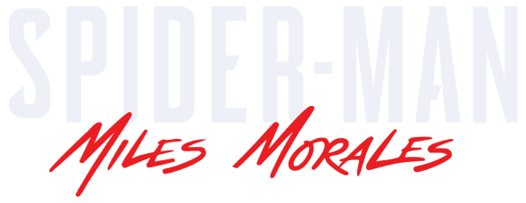
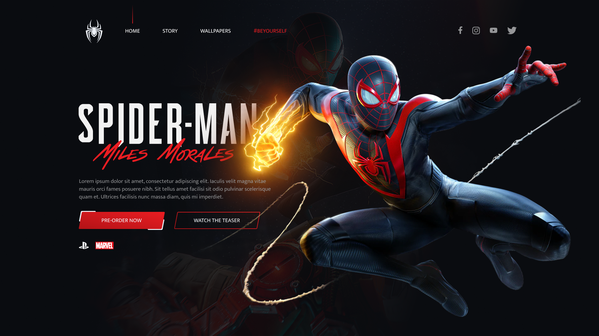

<h1 align="center">
    
</h1>

  <a href="#-technologies">Technologies</a>&nbsp;&nbsp;&nbsp;|&nbsp;&nbsp;&nbsp;
  <a href="#-project">Project</a>

 

  

## 🚀 Technologies

- Javascript
- HTML
- CSS
- Sass
- Tilt
- Green Sock

## 💻 Project

Developed during #FrontWeek, conducted by Násser Yousef:
- Site: https://www.nyousefali.com.br/
- Github: https://github.com/nyousefali
